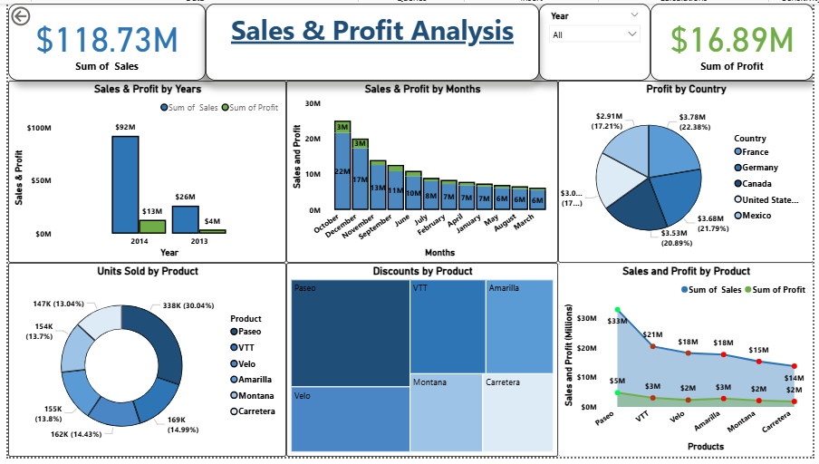

# 📊 Sales & Profit Analysis Dashboard (Power BI)

## 🔹 Project Overview  
This project analyzes company sales and profit performance using **Power BI**.  
The dashboard provides insights into revenue, profit, product performance, discounts, and country-wise contribution.  
It highlights key KPIs and trends to support **data-driven decision making**.  

---

## 🔹 Key Features  

### ✅ Interactive Dashboard built in Power BI  

**KPIs:**  
- Total Sales → **$118.73M**  
- Total Profit → **$16.89M**  

**Visuals Included:**  
- Sales & Profit by Year (**Bar chart**)  
- Sales & Profit by Month (**Column chart**)  
- Profit by Country (**Pie chart**)  
- Units Sold by Product (**Donut chart**)  
- Discounts by Product (**Treemap**)  
- Sales & Profit by Product (**Line & Column chart**)  
- Dynamic Filters (**Year, Product, Country**)  

---

## 🔹 Tools & Skills Used  
- **Power BI** (Data Visualization, Dashboard Design)  
- **DAX** (Calculated Measures & KPIs)  
- **Data Modeling** (Relationships, Hierarchies)  
- **Excel** (Data Source)  

---

## 🔹 Screenshot 

---

## 🔹 Insights Derived  
- 📈 Sales in **2014** with **$92M revenue** and **$13M profit**.  
- 🌍 **France & Germany** contributed the highest profit share.  
- 🏆 **Paseo** was the best-selling product (**338K units**).  
- 💸 Discounts had a **clear negative impact** on profit margins.  

---

## 🔹 How to Use  
1. Clone this repository  
2. Open the `.pbix` file in **Power BI Desktop**  
3. Explore the dashboard and interact with filters  

---

## 🔹 About Me  
I am an **aspiring Data Analyst** with skills in **Power BI, SQL, Python, and Data Visualization**.  
Looking for opportunities to apply my data skills in solving **real-world business problems**.  

📧 Email: *imranmoujan015@gmail.com*  
